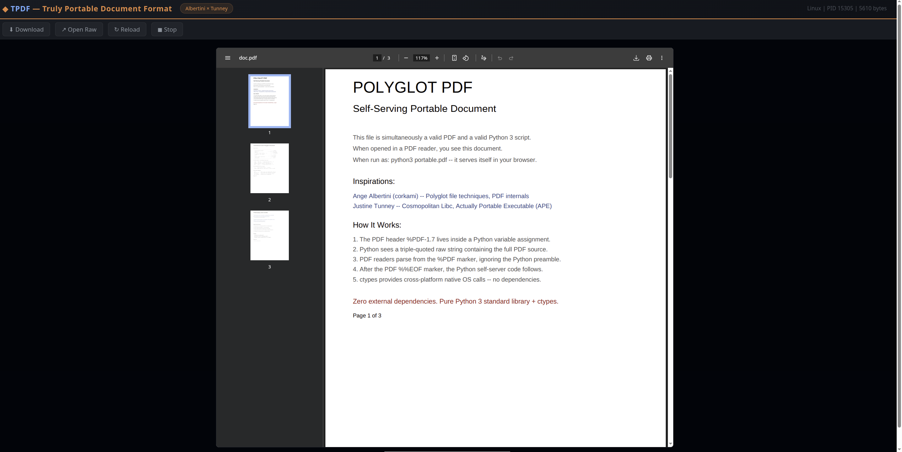

# TPDF — Truly Portable Document Format

A single-file PDF that carries its own interpreter and serves itself on any operating system — no dependencies, no installation, no <b>PDF reader required!</b>

Inspired by **Ange Albertini** (corkami — polyglot file formats, PDF internals) and **Justine Tunney** (Cosmopolitan Libc, Actually Portable Executable, redbean).

---

## What is a .tpdf?

<br>

A `.tpdf` file is a single executable that is simultaneously:

| Format | How it works |
|--------|-------------|
| **APE** (Actually Portable Executable) | Runs natively on Linux, macOS, Windows, FreeBSD, NetBSD, OpenBSD — both x86_64 and ARM64 |
| **ZIP archive** | Contains Python 3.12 stdlib, the TPDF server, and your PDF document as zip entries |
| **Python interpreter** | Full CPython 3.12 compiled with Cosmopolitan Libc — runs anywhere, zero dependencies |
| **Web server** | Built-in HTTP server with a browser-based PDF viewer |

Think of it as **redbean for PDFs** — the same way redbean is a single-file web server that carries its Lua scripts and HTML assets inside its own zip, a `.tpdf` carries Python, a web server, and a PDF inside a single cross-platform executable.

---

## Quick Start

```bash
# Download or build your .tpdf file, then:
chmod +x document.tpdf

# Serve the PDF in your browser (recommended)
./document.tpdf -m tpdf

# Auto-launch (uses .pth hook — may need a moment on first run)
./document.tpdf

# Extract the raw PDF to disk
TPDF_EXTRACT=1 ./document.tpdf

# Use as a Python 3.12 interpreter
./document.tpdf -c "print('hello from portable python')"

# Windows (rename to .exe or use the APE loader)
ren document.tpdf document.exe
document.exe -m tpdf
```

> **Note for Debian/Ubuntu:** If bare `./document.tpdf` drops you into a Python REPL instead of auto-serving, use `./document.tpdf -m tpdf` instead. The auto-launch hook relies on a `.pth` import that can be timing-sensitive on some systems. The `-m tpdf` approach is the most reliable across all platforms.

> **Note for Windows:** On first run, the APE shell header may trigger a SmartScreen warning. You can also rename to `.com` (the traditional APE extension). See the [Cosmopolitan docs](https://github.com/jart/cosmopolitan) for details on the APE loader.

---

## How to Build a .tpdf

### Prerequisites

You need **any** Python 3.8+ on your build machine (just for running the build script — the output is self-contained). Nothing else.

```bash
# That's it. No pip install, no virtualenv, no C compiler.
python3 --version  # any 3.8+ works
```

### Step 1: Get Cosmopolitan Python

Download the pre-built APE Python from the [superconfigure releases](https://github.com/ahgamut/superconfigure/releases):

```bash
# Download lang.zip (contains Python 3.12 APE, ~33 MB)
curl -LO https://github.com/ahgamut/superconfigure/releases/download/z0.0.65/lang.zip

# Extract just the python binary
unzip lang.zip bin/python
chmod +x bin/python

# Verify it works
./bin/python --version
# Python 3.12.3
```

### Step 2: Prepare Your PDF

Any valid PDF works:

```bash
# Use your own PDF
cp /path/to/your/report.pdf my_document.pdf

# Or generate one (with reportlab, weasyprint, LaTeX, LibreOffice, etc.)
python3 -c "
from reportlab.pdfgen import canvas
c = canvas.Canvas('my_document.pdf')
c.drawString(100, 750, 'Hello from TPDF!')
c.save()
"
```

### Step 3: Build

```bash
# Clone or download build_tpdf.py, then:
python3 build_tpdf.py
```

The builder does the following:
1. Copies the Cosmopolitan Python APE as the base executable
2. Compiles the TPDF server code to `.pyc` bytecode
3. Packs the server + your PDF into the APE's internal ZIP
4. Adds a `.pth` auto-launch hook
5. Verifies the result

**Overhead is minimal** — the TPDF server adds only ~14 KB to the 33 MB base interpreter.

### Step 4: Customize the Build

Edit the `build_tpdf()` call at the bottom of `build_tpdf.py`:

```python
build_tpdf(
    python_ape_path='./bin/python',      # Path to cosmo Python APE
    pdf_path='./my_document.pdf',         # Your PDF file
    output_path='./my_document.tpdf'      # Output .tpdf file
)
```

---

## Customizing the Server

The server source code lives in `build_tpdf.py` as the `TPDF_SERVER_PY` string variable. You can modify:

### Change the Viewer UI

Edit the `VIEWER_HTML` variable inside `TPDF_SERVER_PY`. It's a self-contained HTML page with inline CSS — no external dependencies. The default is a dark-themed viewer with download/reload/stop controls.

### Add Server Endpoints

Edit the `do_GET` method in the handler class. The current endpoints are:

| Route | Purpose |
|-------|---------|
| `GET /` | HTML viewer page |
| `GET /doc.pdf` | Raw PDF bytes |
| `GET /health` | JSON status |
| `GET /shutdown` | Stop the server |

You can add your own, for example a table-of-contents API or annotation support.

### Change the Port

The server auto-selects a port starting at 8432. Modify the `range(8432, 8500)` in `main()`.

### Embed Multiple Files

Modify `build_tpdf()` to zip additional assets:

```python
# In the Step 4 section of build_tpdf():
with zipfile.ZipFile(output_path, 'a') as zf:
    zf.writestr('tpdf_assets/document.pdf', pdf_data)
    zf.writestr('tpdf_assets/appendix.pdf', appendix_data)
    zf.writestr('tpdf_assets/data.json', json_data)
```

---

## Can It Run NumPy? PyTorch?

### Short Answer

**No** — not out of the box. NumPy, PyTorch, SciPy, Pandas, and any package with compiled C extensions (`.so` / `.pyd` files) cannot be loaded into Cosmopolitan Python because:

1. **No dynamic linking.** Cosmopolitan Python is statically compiled. It cannot `dlopen()` shared libraries at runtime. NumPy's core is `_multiarray_umath.cpython-312-linux-gnu.so` — a compiled C extension that would need to be statically linked into the interpreter at build time.

2. **No `_ctypes` module.** The cosmo build doesn't include `_ctypes` (the C FFI), which some packages use for binding to native libraries.

3. **No pip install.** You can't `pip install numpy` into an APE — pip needs to download and link compiled wheels, which assumes a normal OS dynamic linker.

### What DOES Work

**Any pure-Python package works perfectly.** Just compile it to `.pyc` and zip it into the APE:

```bash
# Example: adding a pure-Python package
pip download --no-binary :all: some-pure-package
unzip some_pure_package*.whl -d pkg/
# Compile .py → .pyc
./bin/python -m compileall pkg/
# Zip into the APE (use Python's zipfile to properly append)
./bin/python -c "
import zipfile
with zipfile.ZipFile('document.tpdf', 'a') as zf:
    zf.write('pkg/module.pyc', 'Lib/site-packages/module.pyc')
"
```

The following stdlib modules are **fully functional** in Cosmopolitan Python 3.12:

| Category | Working Modules |
|----------|----------------|
| **Web/Network** | `http.server`, `urllib`, `json`, `xml`, `html`, `email`, `socket`, `ssl` |
| **Data** | `sqlite3`, `csv`, `zipfile`, `gzip`, `bz2`, `struct`, `io`, `base64` |
| **Crypto** | `hashlib`, `hmac`, `secrets` |
| **Math** | `math`, `decimal`, `fractions`, `statistics`, `random` |
| **Concurrency** | `threading`, `multiprocessing`, `subprocess`, `asyncio` |
| **Text** | `re`, `textwrap`, `difflib`, `unicodedata` |
| **System** | `os`, `sys`, `signal`, `pathlib`, `shutil`, `tempfile` |

Only three C extensions are missing: `_ctypes`, `_lzma`, `_tkinter`.

### The Nuclear Option: Static NumPy

If you absolutely need NumPy inside a `.tpdf`, the path is:

1. Fork [ahgamut/superconfigure](https://github.com/ahgamut/superconfigure)
2. Add a NumPy build recipe that compiles NumPy + OpenBLAS with `cosmocc`
3. Statically link NumPy's C extensions into the Python interpreter
4. Use your custom `python.com` as the base for `build_tpdf.py`

This is a significant undertaking (NumPy has ~150 C source files and depends on LAPACK/BLAS), but it follows exactly the same pattern that superconfigure uses to build SQLite and other C extensions into the APE. The [Cosmopolitan Discord](https://discord.gg/FwAVVu7eJ4) is the best place to get help with this.

### Alternative: Hybrid Approach

For scientific computing, consider a hybrid where the `.tpdf` serves as the viewer/frontend and delegates heavy computation:

```python
# In your custom server:
# 1. Check if system numpy is available
try:
    import numpy as np
    HAS_NUMPY = True
except ImportError:
    HAS_NUMPY = False

# 2. If not, offer to use system Python
if not HAS_NUMPY:
    import subprocess
    result = subprocess.run(['python3', '-c', 'import numpy; print("OK")'],
                          capture_output=True, text=True)
    if result.returncode == 0:
        # Delegate numpy work to system python
        pass
```

---

## Architecture

```
┌─────────────────────────────────────────────────────┐
│ APE Shell Header (POSIX sh polyglot)                │ ← Runs on any shell
│ MZ/PE Header                                        │ ← Windows native
│ ELF Header                                          │ ← Linux/BSD native  
│ Mach-O Header                                       │ ← macOS native
├─────────────────────────────────────────────────────┤
│ CPython 3.12 Interpreter                            │ ← Cosmopolitan Libc
│ (statically compiled, fat binary: x86_64 + ARM64)   │
├─────────────────────────────────────────────────── ZIP ──┐
│ Lib/                   Python stdlib (.pyc)              │
│ Lib/site-packages/pip/ pip (bundled)                     │
│ Lib/site-packages/tpdf/__init__.pyc                      │
│ Lib/site-packages/tpdf/server.pyc    ← HTTP server       │
│ Lib/site-packages/tpdf/__main__.pyc  ← -m tpdf entry     │
│ Lib/site-packages/tpdf/autolaunch.pyc ← .pth hook        │
│ Lib/site-packages/tpdf_autorun.pth   ← auto-launch       │
│ tpdf_assets/document.pdf             ← your PDF          │
│ usr/share/zoneinfo/...               timezone data        │
├──────────────────────────────────────────────────────────┤
│ ZIP Central Directory                                     │
└──────────────────────────────────────────────────────────┘
```

### How Auto-Launch Works

1. The APE header detects the OS and launches the Python interpreter
2. Python's `site` module processes `.pth` files in `site-packages`
3. `tpdf_autorun.pth` contains `import tpdf.autolaunch`
4. `tpdf.autolaunch` checks if the executable ends in `.tpdf`
5. If no `-c`, `-m`, or script flags are present, it imports `tpdf.server.main()` and starts serving
6. The server extracts the PDF from its own zip (`tpdf_assets/*.pdf`), starts an HTTP server, and opens the browser

### How PDF Extraction Works

The server reads its own executable as a ZIP (APEs are valid ZIPs) and pulls the PDF from the `tpdf_assets/` directory:

```python
with zipfile.ZipFile(sys.executable, 'r') as zf:
    for name in zf.namelist():
        if name.startswith('tpdf_assets/') and name.endswith('.pdf'):
            return zf.read(name)
```

### Platform Detection (ctypes with fallback)

The `PlatformBridge` class tries ctypes first, then falls back to `os.system`:

| Platform | ctypes approach | Fallback |
|----------|----------------|----------|
| **Linux** | `ctypes.CDLL("libc.so.6").system("xdg-open ...")` | `os.system("xdg-open ...")` |
| **macOS** | `ctypes.CDLL("libc.dylib").system("open ...")` | `os.system("open ...")` |
| **Windows** | `ctypes.windll.shell32.ShellExecuteW(...)` | `os.system("start ...")` |
| **BSD** | `ctypes.CDLL("libc.so.7").system(...)` | `os.system("xdg-open ...")` |

In the current Cosmopolitan Python build, `_ctypes` is not compiled, so the fallback path (`os.system` + `webbrowser` module) is used. If you build a custom Cosmopolitan Python with `_ctypes` enabled, the ctypes path will activate automatically.

---

## File Inventory

| File | Purpose |
|------|---------|
| `build_tpdf.py` | The builder — assembles a `.tpdf` from cosmo Python + your PDF |
| `server_code.py` | Reference copy of the server (also embedded in `build_tpdf.py`) |
| `build_polyglot.py` | Builds the lighter `portable.pdf` polyglot (needs system Python) |
| `document.tpdf` | Example output — self-serving 3-page PDF |
| `portable.pdf` | Lighter polyglot alternative (21 KB, needs system Python to serve) |

---

## Comparison: .tpdf vs portable.pdf

| Feature | `.tpdf` | `portable.pdf` |
|---------|---------|----------------|
| **Size** | ~33 MB | ~21 KB |
| **Dependencies** | None | System Python 3 |
| **Platforms** | Linux, macOS, Windows, BSD | Anywhere with Python |
| **Opens in PDF reader** | Some readers (scans for %PDF) | Yes (valid polyglot) |
| **Self-serves** | Yes | Yes |
| **As Python interpreter** | Yes (full CPython 3.12) | No |
| **Technique** | Tunney (APE + cosmo) | Albertini (polyglot) |

Use `.tpdf` when you need zero-dependency portability across OS boundaries. Use `portable.pdf` when file size matters and Python is available.

---

## Troubleshooting

**"Opens Python REPL instead of serving"** — Use `./document.tpdf -m tpdf` for the most reliable launch. The auto-launch `.pth` hook works but can be sensitive to the APE startup sequence on some systems.

**"Permission denied"** — Run `chmod +x document.tpdf`.

**"Bad interpreter" or "cannot execute binary"** — The APE format uses a shell polyglot header. Try: `sh document.tpdf -m tpdf`, or on newer systems, install the APE loader: `sudo sh -c "echo ':APE:M::MZqFpD::/usr/bin/ape:' >/proc/sys/fs/binfmt_misc/register"`.

**"Browser didn't open"** — The server prints the URL. Open `http://127.0.0.1:8432` manually. On headless systems, use `curl http://127.0.0.1:8432/doc.pdf > output.pdf`.

**Windows SmartScreen warning** — Expected for unsigned executables. Click "More info" → "Run anyway", or rename to `.com`.

---

## Credits

- **Ange Albertini** ([@corkami](https://github.com/corkami)) — Pioneered polyglot file research, PDF format internals, and the concept that file formats are overlapping territories
- **Justine Tunney** ([@jart](https://github.com/jart)) — Created Cosmopolitan Libc, Actually Portable Executable, redbean, and proved that a C program can run everywhere from a single binary
- **Gautham Venkatasubramanian** ([@ahgamut](https://github.com/ahgamut)) — Ported CPython to Cosmopolitan, maintains superconfigure, made "Actually Portable Python" a reality

---

## License

The TPDF builder and server code are provided MIT License. Cosmopolitan Libc is ISC licensed. CPython is PSF licensed. Your PDF content retains whatever license you choose.
